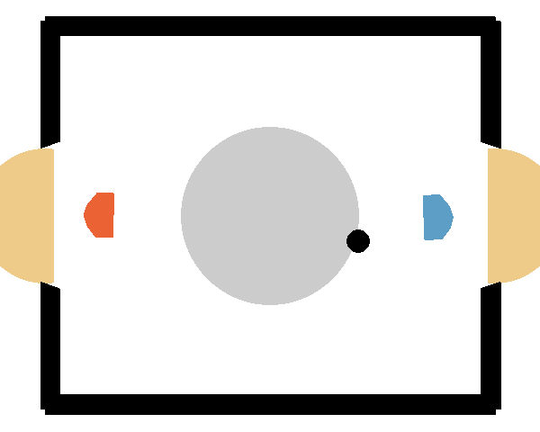

# Reinforcement Learning for 1v1 Hockey

**Jannik Rombach, Adriano Polzer** — RL Course 2025/26 at the University of Tübingen.



## Overview

We train RL agents for a 1v1 hockey environment, implementing and comparing TD3 and SAC
under different training conditions. The core finding: training against a diverse opponent
pool is the primary driver of agent robustness.

## Report

[report.pdf](report.pdf)

## Project Structure

```

DRAI-RL/
├── src/
│ ├── agents/ # TD3 and SAC agent implementations
│ ├── common/ # Shared utilities and config management
│ ├── configs/ # YAML configuration files
│ ├── environments/ # Environment wrapper
│ ├── evaluation/ # Match runner and TrueSkill leaderboard
│ ├── final_tournamen_agents/ # Final agent checkpoints for the tournament
│ ├── notebooks/ # Experiment notebooks
│ ├── training/ # Standard and self-play trainers
│ ├── evaluate.py # Evaluation and tournament entry point
│ ├── train.py # Training entry point
│ └── run_client.py # Tournament client
├── report/ # Final project report
├── docs/ # Additional docs
└── requirements.txt

```

## Installation

Requires Python 3.12.

```bash
pip install -r requirements.txt
```

## Training

All training is configured via YAML files in `configs/`. Two modes are available,
selected automatically from the config via the `training_mode` field.

**Standard training** — trains against fixed opponents (weak/strong basic opponent):

```bash
python src/train.py --config src/configs/td3/checkpoint3_hockey_strong.yaml
```

**Self-play training** — trains against a growing opponent pool:

```bash
python src/train.py --config src/configs/td3/checkpoint4_selfplay.yaml
```

To resume training from a checkpoint:

```bash
python src/train.py --config src/configs/td3/checkpoint4_selfplay.yaml \
                    --checkpoint logs/.../agent_final.pth
```

To override the seed:

```bash
python src/train.py --config src/configs/td3/checkpoint3_hockey_strong.yaml --seed 42
```

### TensorBoard

Training metrics are logged automatically and can be monitored with TensorBoard:

```bash
tensorboard --logdir src/logs
```

### Configuration

All hyperparameters, training mode, reward shaping weights, and self-play settings are
controlled via YAML config files. For a full overview of available options see the
annotated template at `src/configs/td3_template.yaml`.

## Evaluation

### Standard Environments

Evaluate a trained agent on any Gymnasium environment:

```bash
python src/evaluate.py --agent logs/td3/.../agent_final.pth \
                       --config src/configs/td3/checkpoint1_lunarlander.yaml \
                       --episodes 20 --render
```

### Hockey Tournament

Run a full round-robin tournament with TrueSkill leaderboard:

```bash
python src/evaluate.py --agent logs/td3/.../agent_final.pth logs/sac/.../agent_final.pth \
                       --config src/configs/td3/hockey.yaml src/configs/sac/hockey.yaml \
                       --episodes 100
```

To resume from an existing leaderboard:

```bash
python src/evaluate.py --agent logs/td3/.../agent_final.pth \
                       --config src/configs/td3/hockey.yaml \
                       --episodes 100 --load-leaderboard logs/eval/leaderboard.json
```

### Record a Match as GIF

Record a single match of the agent vs the strong basic opponent:

```bash
python src/evaluate.py --agent logs/sac/.../agent_final.pth \
                       --config src/configs/sac/hockey.yaml \
                       --record-match --record-path agent.gif --record-episodes 3
```
